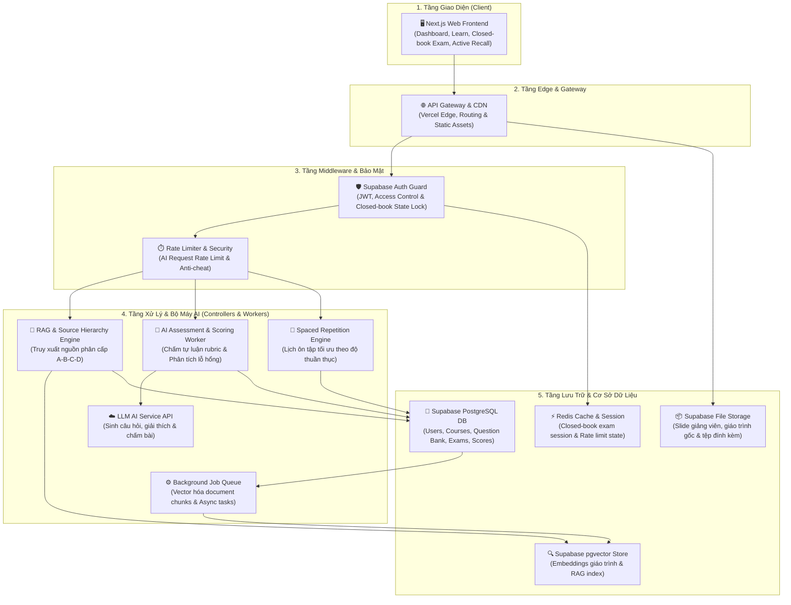

# 🏛️ Kiến Trúc Hệ Thống: App Triết Học Thạc Sĩ (Master's Philosophy Learning App)

> Tài liệu mô tả chi tiết kiến trúc tổng thể, luồng dữ liệu và phân tầng hệ thống ứng dụng ôn luyện & chấm thi Triết học Thạc sĩ.

---

## 📊 Sơ Đồ Khối Tổng Thể (Mermaid Diagram)

---

## 🧩 Phân Tích Chi Tiết Các Tầng Hợp Thành

### 1. Tầng Giao Diện Người Dùng (Client Layer)
- **`client-web-app` (🖥️ Next.js Web Frontend)**
  - Giao diện SPA/SSR hiện đại xây dựng trên Next.js App Router.
  - Cung cấp các phân hệ chính:
    - **Dashboard**: Thống kê lộ trình học tập, độ thuần thục chủ đề.
    - **Learn Screen**: Học bài chủ động (Active Learning), đọc bài giảng gắn nguồn.
    - **Closed-book Exam**: Chế độ thi khóa tài liệu, kiểm soát gian lận nghiêm ngặt.
    - **Active Recall**: Thẻ ghi nhớ thông minh và câu hỏi gợi mở suy luận triết học.

### 2. Tầng Edge & Gateway (Edge & Routing Tier)
- **`edge-gateway` (🌐 API Gateway & CDN)**
  - Tích hợp Vercel Edge Network phân phối nhanh tài nguyên tĩnh.
  - Điểu phối và điều hướng HTTP request đến các dịch vụ phía sau.
  - Phân phối file đính kèm trực tiếp từ `storage-documents`.

### 3. Tầng Middleware & Bảo Mật (Security & Middleware Layer)
- **`auth-guard` (🛡️ Supabase Auth Guard)**
  - Xác thực người dùng qua JWT (JSON Web Token).
  - Kiểm tra phân quyền truy cập (Student / Instructor / Admin).
  - Quản lý trạng thái khóa (Lock State) khi học viên bước vào bài thi Closed-book.
- **`rate-limiter` (⏱️ Rate Limiter & Security)**
  - Bảo vệ các API gọi tới LLM AI khỏi hành vi lạm dụng (Rate limiting).
  - Phát hiện hành vi nghi vấn gian lận khi làm bài thi trực tuyến.

### 4. Tầng Xử Lý & Bộ Máy AI (Controllers & Engine Workers)
- **`controller-rag` (🧠 RAG & Source Hierarchy Engine)**
  - Trái tim của ứng dụng Triết học: Truy xuất tài liệu học thuật theo phân cấp 4 tầng (Nguồn A: Tác phẩm kinh điển -> Nguồn B: Giáo trình chuẩn -> Nguồn C: Chuyên luận thạc sĩ -> Nguồn D: Đề thi & đáp án).
  - Đảm bảo câu trả lời của AI chính xác, không tự bịa đặt (Hallucination protection).
- **`controller-ai-tutor` (🤖 AI Assessment & Scoring Worker)**
  - Phân tích và chấm bài thi tự luận triết học theo Rubric chi tiết (Cơ sở lý luận, Liên hệ thực tiễn, Tính logic).
  - Phân tích lỗ hổng kiến thức và đưa ra nhận xét định hướng cá nhân hóa.
- **`controller-spaced-repetition` (📅 Spaced Repetition Engine)**
  - Áp dụng thuật toán Spaced Repetition (FSRS / SM-2) tính toán khoảng thời gian lặp lại tối ưu cho từng chủ đề dựa trên điểm số thuần thục.
- **`queue-background` (⚙️ Background Job Queue)**
  - Xử lý các tác vụ nặng bất đồng bộ: Chia nhỏ tài liệu (Chunking), gọi API Embedding, cập nhật thống kê tổng hợp.
- **`external-ai-api` (☁️ LLM AI Service API)**
  - Tích hợp với các mô hình ngôn ngữ lớn (Gemini, OpenAI, Claude) phục vụ sinh đề thi, gợi ý giải thích và phân tích tự luận.

### 5. Tầng Cơ Sở Dữ Liệu & Lưu Trữ (Database & Storage Tier)
- **`database-main` (🐘 Supabase PostgreSQL DB)**
  - Đơn vị lưu trữ quan hệ chính (Users, Courses, Topics, Question Bank, Exam Attempts, Mastery Scores).
- **`database-pgvector` (🔍 Supabase pgvector Store)**
  - Cơ sở dữ liệu Vector mở rộng trên PostgreSQL để lưu trữ vector embeddings của giáo trình triết học.
- **`database-cache` (⚡ Redis Cache & Session)**
  - Lưu trữ Session bài thi closed-book trực tuyến và trạng thái đếm rate limit.
- **`storage-documents` (📦 Supabase File Storage)**
  - Lưu trữ file tài liệu PDF/DOCX gốc, slide bài giảng, hình ảnh minh họa.

---

## 🔁 Luồng Hoạt Động Điển Hình (Workflow Scenarios)

### Scenario A: Học viên nộp bài thi Tự luận Triết học (Closed-book Exam)
1. `client-web-app` gửi câu trả lời qua `edge-gateway`.
2. `auth-guard` kiểm tra JWT và xác minh trạng thái phiên thi khóa trong `database-cache`.
3. `rate-limiter` kiểm tra hạn ngạch gọi API.
4. Request chuyển tới `controller-ai-tutor`.
5. `controller-ai-tutor` gửi bài làm + Rubric tới `external-ai-api` để chấm điểm và phân tích lỗ hổng.
6. Kết quả bài làm & điểm số được lưu vào `database-main`.
7. `database-main` kích hoạt `queue-background` để cập nhật độ thuần thục (Mastery Score) cho học viên.

### Scenario B: Học viên đặt câu hỏi tra cứu triết học (RAG Search)
1. `client-web-app` gửi câu hỏi qua `edge-gateway` -> `auth-guard` -> `rate-limiter`.
2. `controller-rag` thực hiện semantic search trên `database-pgvector` tìm các đoạn trích giáo trình phù hợp nhất.
3. `controller-rag` đối chiếu và xếp hạng nguồn phân cấp A-B-C-D trong `database-main`.
4. Kết quả kèm trích dẫn nguồn chuẩn xác được trả về cho `client-web-app`.

---
*Tài liệu kiến trúc hệ thống được khởi tạo tự động dựa trên sơ đồ thiết kế hệ thống App Triết Học Thạc Sĩ.*
